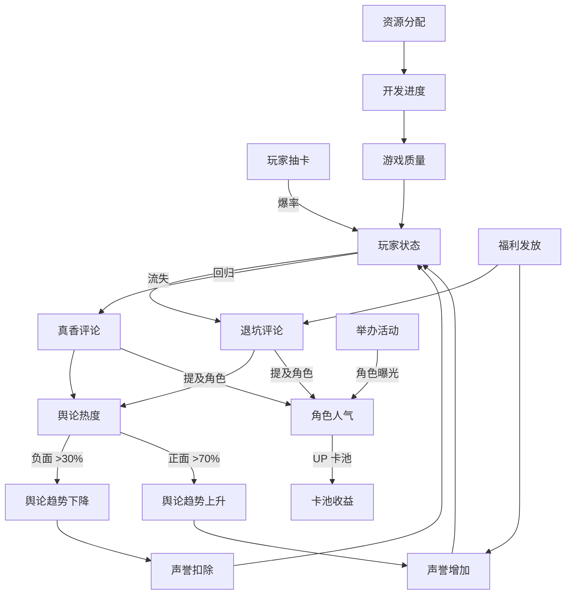

# 代码分析报告 - 乙女游戏创作者模拟器

**分析日期**: 2026-03-02  
**分析重点**: 
1. 页面内容/数据的相互影响关系
2. AI 生成的应用场景
3. 静态数据存储方案

---

## 1. 数据相互影响分析

### 1.1 已实现的联动关系 ✅

#### 评论系统 → 角色人气系统
**当前实现**:
```typescript
// commentStore.ts - generateNewComments()
gameStore.analyzeCommentMentions(newComments.map(c => ({
  content: c.content,
  sentiment: c.sentiment
})));
```

**影响链**:
- 生成评论 → 分析角色提及 → 更新 discussionHeat
- 正面评论 → popularity +0.5
- 负面评论 → popularity -0.5
- 提及多个角色 → cpHeat 双向 +1

**数据流**:
```
评论生成 → analyzeCommentMentions() → updateCharacterPopularity()
  ↓
讨论热度 ↑ / 人气值 ↑↓ / CP 热度 ↑
```

---

#### 角色人气 → 卡池收益
**当前实现**:
```typescript
// operationStore.ts - simulatePoolGacha()
let popularityBonus = 1.0;
if (pool.upCharacters.length > 0) {
  const charId = pool.upCharacters[0];
  popularityBonus = gameStore.calculatePopularityBonus(charId);
  pool.popularityBonus = popularityBonus;
}
pool.revenue = Math.round(baseRevenue * popularityBonus);
```

**影响链**:
- 人气>80 → 收入 +50% (1.5x)
- 人气<30 → 收入 -30% (0.7x)
- 人气 50 → 无加成 (1.0x)

**数据流**:
```
角色人气值 → calculatePopularityBonus() → 卡池收入计算
  ↓
高人气 UP = 必抽 = 收入增加
低人气 UP = 跳过 = 收入减少
```

---

#### 福利发放 → 评论系统
**当前实现**:
```typescript
// operationStore.ts - sendWelfare()
commentStore.comments.unshift({
  id: `welfare_${Date.now()}`,
  content: randomComment,
  type: 'game',
  sentiment: 'positive',
  playerType: 'official',
  tags: ['福利', '公告'],
  // ...
});
commentStore.updatePublicOpinion();
```

**影响链**:
- 发放福利 → 消耗 1000 钻石 → 生成系统公告评论
- 评论平台：微博/抖音随机
- 评论情感：正面
- 增加声誉 +5

**数据流**:
```
福利发放 → 消耗钻石 → 生成公告评论 → 更新舆论
  ↓
声誉 ↑ / 正面评论 ↑ / 舆论热度 ↑
```

---

### 1.2 缺失的联动关系 ❌

#### ① 玩家状态 → 评论生成（退坑/真香）
**应该实现**:
```typescript
// playerStore.ts - updatePlayerStates()
if (player.state === PlayerState.LOST) {
  // 自动生成退坑评论
  commentStore.generateLossComment(player);
  // 评论内容："这游戏不值得，退坑了"
}

if (player.state === PlayerState.RETURNED) {
  // 自动生成真香评论
  commentStore.generateReturnComment(player);
  // 评论内容："还是舍不得老公们，我回来了"
}
```

**影响链**:
```
毒池爆率 → 玩家流失 → 退坑评论 ↑ → 舆论恶化
良心池 → 玩家回归 → 真香评论 ↑ → 舆论好转
```

**当前状态**: ❌ 只有数据结构，没有自动触发

---

#### ② 节奏事件 → 声誉自动扣除
**应该实现**:
```typescript
// commentStore.ts 或 operationStore.ts
function applyRhythmDamage() {
  rhythmEvents.value.forEach(event => {
    if (!event.resolved) {
      operationStore.stats.reputation += event.reputationImpact;
      // 小节奏 -2/小时，大节奏 -5/小时，炎上 -10/小时
      event.duration--;
      if (event.duration <= 0) {
        event.resolved = true;
      }
    }
  });
}
```

**影响链**:
```
负面评论热度>100 → 触发节奏事件 → 每小时扣除声誉
  ↓
声誉 ↓ → 玩家满意度 ↓ → 流失率 ↑
```

**当前状态**: ❌ 只记录 reputationImpact，没有定时扣除

---

#### ③ 卡池爆率 → 玩家状态自动转换
**应该实现**:
```typescript
// playerStore.ts - updatePlayerStatesAutomatically()
setInterval(() => {
  players.value.forEach(player => {
    const daysSinceLastLogin = getDaysSince(player.lastLoginAt);
    
    // 超过 30 天未登录 → 流失
    if (daysSinceLastLogin > 30 && player.state !== PlayerState.LOST) {
      player.state = PlayerState.LOST;
    }
    
    // 流失玩家超过 60 天 → 30% 概率回归
    if (daysSinceLastLogin > 60 && player.state === PlayerState.LOST) {
      if (Math.random() < 0.3) {
        player.state = PlayerState.RETURNED;
      }
    }
  });
}, 3600000); // 每小时检查一次
```

**影响链**:
```
毒池 → 连续歪 → 玩家流失 → 退坑评论
良心池 → 出货率高 → 玩家活跃 → 正面评论
```

**当前状态**: ❌ 只在抽卡时更新状态，不抽卡不会自动流失

---

#### ④ 活动效果 → 角色人气
**应该实现**:
```typescript
// operationStore.ts - calculateEventImpact()
function calculateEventImpact(event: GameEvent) {
  const gameStore = useGameStore();
  
  // 角色生日活动 → 该角色人气 +5
  if (event.type === 'birthday') {
    event.characterIds.forEach(charId => {
      gameStore.updateCharacterPopularity(charId, { popularity: 5 });
    });
  }
  
  // 节日活动 → 参与角色人气 +2
  if (event.type === 'festival') {
    // ...
  }
}
```

**影响链**:
```
举办活动 → 角色曝光 ↑ → 人气 ↑ → 卡池收入 ↑
```

**当前状态**: ❌ 活动效果计算未实现

---

#### ⑤ 评论热度 → 舆论趋势
**应该实现**:
```typescript
// commentStore.ts - updatePublicOpinion()
function updatePublicOpinion() {
  const totalHeat = comments.value.reduce((sum, c) => sum + c.heat, 0);
  const negativeHeat = commentsBySentiment.value('negative')
    .reduce((sum, c) => sum + c.heat, 0);
  
  publicOpinion.value.heat = Math.min(100, totalHeat / 10);
  publicOpinion.value.sentiment = ((positive - negative) / total) * 100;
  
  // 负面评论占比>30% → 趋势下降
  if (negativeHeat / totalHeat > 0.3) {
    publicOpinion.value.trend = 'down';
  }
}
```

**影响链**:
```
负面评论热度高 → 舆论趋势下降 → 声誉 ↓ → 玩家流失
正面评论热度高 → 舆论趋势上升 → 声誉 ↑ → 玩家活跃
```

**当前状态**: ⚠️ 有计算逻辑，但不够完善

---

#### ⑥ 资源分配 → 开发进度
**应该实现**:
```typescript
// gameStore.ts - applyResourceStrategy()
function applyResourceStrategy(strategy: ResourceStrategy) {
  const config = strategyConfigs[strategy];
  
  // 分配金币
  const operationGold = gold * config.gold.operation;
  const devGold = gold * config.gold.development;
  
  // 分配开发点数
  const charPoints = devPoints * config.devPoints.character;
  const plotPoints = devPoints * config.devPoints.plot;
  
  // 影响开发效率
  developmentProgress += charPoints + plotPoints;
}
```

**影响链**:
```
资源分配策略 → 开发进度 → 游戏质量 → 玩家满意度 → 收入
```

**当前状态**: ❌ 只有配置，没有实际应用

---

### 1.3 数据联动关系图



---

## 2. AI 生成应用场景分析

### 2.1 已实现 AI 生成的功能 ✅

#### ① 评论生成
**当前实现**:
```typescript
// commentStore.ts - generateNewComments()
async function generateNewComments(params: GenerateParams) {
  const cost = 20; // 消耗 20 积分
  // 检查积分
  await pointsStore.spendPoints(cost, `AI 生成${params.count}条评论`);
  
  // 生成评论
  for (let i = 0; i < params.count; i++) {
    const template = generateComment(params.commentType, params.playerType);
    // ...
  }
}
```

**使用场景**:
- 用户点击"生成新评论"按钮
- 消耗 20 积分生成 5 条评论
- 自动分析角色提及并更新人气

**模板来源**: `src/data/templates/comments/index.ts`

---

#### ② 运营事件模板生成
**当前实现**:
```typescript
// operationStore.ts - triggerRandomIncident()
function triggerRandomIncident() {
  const incident = generateRandomIncident();
  incidents.value.push({
    ...incident,
    status: 'pending',
    createdAt: new Date().toISOString()
  });
}
```

**使用场景**:
- 每日结算时 30% 概率触发
- 从模板库随机选择事件
- 提供多个解决方案

**模板来源**: `src/data/templates/incidents/index.ts`

---

#### ③ 活动模板选择
**当前实现**:
```typescript
// operationStore.ts - createEventFromTemplate()
async function createEventFromTemplate(templateId: string) {
  const templates = getEventTemplates();
  const template = templates.find(t => t.id === templateId);
  
  if (template) {
    // 创建活动
  }
}
```

**使用场景**:
- 用户浏览活动模板
- 选择模板创建活动
- 20+ 活动模板可选

**模板来源**: `src/data/templates/events/index.ts`

---

### 2.2 应该使用 AI 生成的内容 ❌

#### ① 角色对话/互动内容
**应该实现**:
```typescript
// 使用 AI 生成角色互动对话
async function generateCharacterDialogue(
  characterId: string, 
  context: string
): Promise<string> {
  const aiService = useAiService();
  const character = getCharacter(characterId);
  
  const prompt = `
    角色名：${character.name}
    性格：${character.personality.join(',')}
    场景：${context}
    
    请生成一段符合角色性格的对话（50 字以内）
  `;
  
  return await aiService.generateText(prompt);
}
```

**应用场景**:
- 玩家点击角色头部 → 生成互动对话
- 玩家告白 → 生成回应
- 日常对话系统

**预期效果**: 每个角色有独特的说话风格

---

#### ② 剧情章节生成
**应该实现**:
```typescript
// AI 辅助剧情生成
async function generatePlotChapter(
  characterIds: string[],
  routeType: 'sweet' | 'angst' | 'suspense',
  chapterNumber: number
): Promise<Chapter> {
  const aiService = useAiService();
  
  const prompt = `
    角色：${characterIds.join(',')}
    路线：${routeType}
    章节：第${chapterNumber}章
    
    请生成剧情大纲，包括：
    1. 场景描述
    2. 关键事件
    3. 玩家选择支（3 个选项）
  `;
  
  return await aiService.generatePlot(prompt);
}
```

**应用场景**:
- 创建新剧情时辅助生成
- 提供剧情灵感
- 生成选择支和分支

---

#### ③ 角色设定补充
**应该实现**:
```typescript
// AI 补充角色设定
async function expandCharacterProfile(
  basicInfo: { name: string; appearance: string }
): Promise<Partial<Character>> {
  const aiService = useAiService();
  
  const prompt = `
    角色名：${basicInfo.name}
    外貌：${basicInfo.appearance}
    
    请补充：
    1. 性格特点（5 个标签）
    2. 背景故事（100 字）
    3. 互动反应（摸头/拥抱/牵手/告白的回应）
    4. 语音触发台词（5 句）
    5. 约会场景（3 个）
  `;
  
  return await aiService.generateCharacter(prompt);
}
```

**应用场景**:
- 快速创建角色
- 补充角色细节
- 生成互动台词

---

#### ④ 玩家评论智能回复
**应该实现**:
```typescript
// AI 生成官方回复
async function generateOfficialReply(
  comment: GameComment
): Promise<string> {
  const aiService = useAiService();
  
  const prompt = `
    玩家评论：${comment.content}
    情感：${comment.sentiment}
    
    请生成官方回复：
    - 负面评论：道歉 + 补偿方案
    - 正面评论：感谢 + 鼓励
    - 建议：感谢 + 采纳说明
  `;
  
  return await aiService.generateReply(prompt);
}
```

**应用场景**:
- 自动回复玩家评论
- 危机公关处理
- 提升玩家满意度

---

#### ⑤ 活动文案生成
**应该实现**:
```typescript
// AI 生成活动文案
async function generateEventCopywriting(
  eventType: EventType,
  theme: string
): Promise<{ name: string; description: string }> {
  const aiService = useAiService();
  
  const prompt = `
    活动类型：${eventType}
    主题：${theme}
    
    请生成：
    1. 活动名称（10 字以内，吸引眼球）
    2. 活动描述（50 字，突出亮点）
    3. 宣传语（20 字，朗朗上口）
  `;
  
  return await aiService.generateCopywriting(prompt);
}
```

**应用场景**:
- 快速生成活动文案
- A/B 测试多个版本
- 提升活动吸引力

---

#### ⑥ 角色 CP 互动剧情
**应该实现**:
```typescript
// AI 生成 CP 互动
async function generateCpInteraction(
  char1Id: string,
  char2Id: string,
  heat: number
): Promise<string> {
  const aiService = useAiService();
  
  const prompt = `
    角色 1: ${char1.name}
    角色 2: ${char2.name}
    CP 热度：${heat}
    
    请生成一段两人的互动小剧场（200 字）：
    - 体现角色性格
    - 展现 CP 感
    - 有对话有动作
  `;
  
  return await aiService.generateCpStory(prompt);
}
```

**应用场景**:
- CP 热度达到阈值自动解锁
- 粉丝福利
- 促进 CP 文化传播

---

#### ⑦ 玩家流失预警分析
**应该实现**:
```typescript
// AI 分析流失风险
async function analyzeLossRisk(player: Player): Promise<{
  risk: 'low' | 'medium' | 'high';
  reasons: string[];
  suggestions: string[]
}> {
  const aiService = useAiService();
  
  const prompt = `
    玩家数据：
    - 总抽卡：${player.totalDraws}
    - SSR 数量：${player.ssrCount}
    - 幸运值：${player.luckValue}
    - 最后登录：${player.lastLoginAt}
    
    请分析：
    1. 流失风险等级
    2. 可能原因（3 个）
    3. 挽回建议（3 个）
  `;
  
  return await aiService.analyzePlayer(prompt);
}
```

**应用场景**:
- 识别高风险玩家
- 精准推送福利
- 降低流失率

---

#### ⑧ 舆情分析报告
**应该实现**:
```typescript
// AI 生成舆情报告
async function generateOpinionReport(): Promise<{
  summary: string;
  hotTopics: string[];
  sentiment: 'positive' | 'negative' | 'neutral';
  suggestions: string[]
}> {
  const aiService = useAiService();
  
  const prompt = `
    评论数据：
    - 总评论：${comments.length}
    - 正面：${positiveCount}
    - 负面：${negativeCount}
    - 热度：${publicOpinion.heat}
    - 趋势：${publicOpinion.trend}
    
    请生成：
    1. 舆情总结（50 字）
    2. 热门话题（5 个）
    3. 情感倾向
    4. 应对建议（3 个）
  `;
  
  return await aiService.generateReport(prompt);
}
```

**应用场景**:
- 每日舆情汇总
- 危机预警
- 决策支持

---

### 2.3 AI 生成优先级排序

| 优先级 | 功能 | 实现难度 | 预期效果 |
|--------|------|----------|----------|
| **P0** | 角色对话生成 | 中 | 显著提升沉浸感 |
| **P0** | 角色设定补充 | 低 | 加速角色创建 |
| **P1** | 剧情章节生成 | 高 | 辅助剧情创作 |
| **P1** | 玩家评论回复 | 中 | 提升满意度 |
| **P2** | 活动文案生成 | 低 | 提升吸引力 |
| **P2** | CP 互动剧情 | 中 | 促进 CP 文化 |
| **P2** | 流失预警分析 | 高 | 降低流失率 |
| **P2** | 舆情分析报告 | 中 | 决策支持 |

---

## 3. 静态数据存储方案分析

### 3.1 当前静态数据分类

#### ① 模板数据（已独立）✅
**位置**: `src/data/templates/`

**文件清单**:
```
src/data/templates/
├── characters/
│   ├── index.ts          # 角色创建模板
│   ├── president.ts      # 总裁型角色模板
│   └── senior.ts         # 学长型角色模板
├── comments/
│   └── index.ts          # 评论生成模板
├── events/
│   └── index.ts          # 活动模板（节日/生日/联动）
├── incidents/
│   └── index.ts          # 运营事件模板
└── platformComments/
    └── index.ts          # 多平台评论模板（5 平台各 20 条）
```

**特点**:
- ✅ 已独立为 data 文件
- ✅ 按类型分类清晰
- ✅ 易于维护和扩展
- ✅ 支持动态加载

**示例**:
```typescript
// src/data/templates/incidents/index.ts
const dropRateIncidents: Omit<IncidentTemplate, 'id'>[] = [
  {
    type: 'dropRate',
    name: '百连无 SSR',
    description: '有玩家发帖称连续 100 抽未获得 SSR...',
    severity: '高',
    solutions: [...]
  }
];
```

---

#### ② 配置数据（分散在 Store 中）⚠️
**位置**: 各个 Store 文件中

**示例**:
```typescript
// playerStore.ts
const DEFAULT_GACHA_CONFIG: GachaConfig = {
  ssrRate: 0.03,        // 3% SSR 概率
  srRate: 0.10,         // 10% SR 概率
  pityThreshold: 90,    // 90 抽保底
  softPityStart: 75     // 75 抽开始软保底
};

// gameStore.ts
const strategyConfigs: Record<ResourceStrategy, StrategyConfig> = {
  conservative: {
    name: '保守型',
    description: '稳扎稳打，注重长期发展',
    gold: { operation: 0.4, development: 0.4, reserve: 0.2 },
    devPoints: { character: 0.4, plot: 0.4, event: 0.2 }
  },
  // ...
};
```

**问题**:
- ❌ 与业务逻辑混在一起
- ❌ 难以独立修改
- ❌ 不便于版本管理
- ❌ 无法热更新

---

#### ③ 角色预设数据（部分独立）⚠️
**位置**: `src/data/templates/characters/`

**当前状态**:
```typescript
// src/data/templates/characters/president.ts
export const presidentTemplates = [
  {
    name: '霸道总裁',
    appearance: '西装革履，气场强大',
    personality: ['霸道', '专一', '强势'],
    background: '商业帝国继承人...'
  }
];
```

**问题**:
- ⚠️ 只有部分角色类型
- ⚠️ 缺少完整角色数据库

---

### 3.2 建议的静态数据存储方案

#### 方案：独立 data 目录 + JSON 格式

**目录结构**:
```
src/data/
├── config/                    # 配置数据
│   ├── gacha.json            # 抽卡配置
│   ├── playerState.json      # 玩家状态配置
│   └── resourceStrategy.json # 资源策略配置
│
├── templates/                 # 模板数据（已有）
│   ├── characters/           # 角色模板
│   ├── events/               # 活动模板
│   ├── incidents/            # 事件模板
│   └── comments/             # 评论模板
│
├── characters/                # 角色数据库
│   ├── archetypes.json       # 角色原型（总裁/学长等）
│   ├── personalities.json    # 性格组合库
│   └── backgrounds.json      # 背景故事库
│
├── plots/                     # 剧情数据库
│   ├── routes.json           # 路线模板（甜宠/虐恋/悬疑）
│   ├── chapters.json         # 章节模板
│   └── choices.json          # 选择支库
│
└── dialogue/                  # 对话库
    ├── daily.json            # 日常对话
    ├── interaction.json      # 互动对话
    └── event.json            # 事件对话
```

---

#### 具体实现示例

**① 抽卡配置** (`src/data/config/gacha.json`):
```json
{
  "default": {
    "ssrRate": 0.03,
    "srRate": 0.10,
    "pityThreshold": 90,
    "softPityStart": 75,
    "description": "默认抽卡配置"
  },
  "upEvent": {
    "ssrRate": 0.06,
    "srRate": 0.15,
    "pityThreshold": 80,
    "softPityStart": 70,
    "description": "UP 活动期间配置"
  },
  "newbie": {
    "ssrRate": 0.10,
    "srRate": 0.20,
    "pityThreshold": 60,
    "softPityStart": 50,
    "description": "新手福利池配置"
  }
}
```

**使用方式**:
```typescript
// playerStore.ts
import gachaConfig from '@/data/config/gacha.json';

function loadConfig(configName: string = 'default') {
  return gachaConfig[configName];
}
```

---

**② 角色原型库** (`src/data/characters/archetypes.json`):
```json
{
  "president": {
    "name": "霸道总裁",
    "appearanceOptions": [
      "西装革履，气场强大",
      "定制西装，眼神锐利",
      "商务装扮，不怒自威"
    ],
    "personalityTags": ["霸道", "专一", "强势", "傲娇", "占有欲"],
    "backgroundTemplate": "商业帝国第{generation}代继承人，年仅{age}岁就掌控着万亿商业帝国...",
    "interactionStyle": "commanding",
    "popularityBase": 70
  },
  "senior": {
    "name": "温柔学长",
    "appearanceOptions": [
      "白衬衫，温柔笑容",
      "毛衣开衫，书卷气息",
      "休闲装扮，阳光帅气"
    ],
    "personalityTags": ["温柔", "体贴", "学霸", "可靠", "治愈"],
    "backgroundTemplate": "比你大三届的学长，是学校的风云人物...",
    "interactionStyle": "gentle",
    "popularityBase": 65
  }
}
```

---

**③ 剧情路线模板** (`src/data/plots/routes.json`):
```json
{
  "sweet": {
    "name": "甜宠路线",
    "description": "甜蜜宠溺，全程高糖",
    "chapterStructure": [
      "初遇 → 误会 → 和解 → 暧昧 → 告白 → 热恋",
      "6 个章节，每章 3-5 个选择支"
    ],
    "keyEvents": [
      "英雄救美",
      "生病照顾",
      "生日惊喜",
      "当众告白",
      "见家长"
    ],
    "emotionalCurve": "上升型"
  },
  "angst": {
    "name": "虐恋路线",
    "description": "虐恋情深，曲折坎坷",
    "chapterStructure": [
      "相爱 → 误会 → 分离 → 重逢 → 解开误会 → 圆满",
      "8 个章节，每章 2-4 个选择支"
    ],
    "keyEvents": [
      "身世之谜",
      "被迫分离",
      "失忆",
      "绝症",
      "牺牲"
    ],
    "emotionalCurve": "波浪型"
  }
}
```

---

**④ 日常对话库** (`src/data/dialogue/daily.json`):
```json
{
  "morning": [
    {
      "trigger": "早上登录",
      "dialogues": {
        "president": "早。今天的行程我已经安排好了，不会让你等太久。",
        "senior": "早啊~昨晚睡得好吗？我给你带了早餐。",
        "idol": "早安！今天也要为我加油哦~"
      }
    }
  ],
  "night": [
    {
      "trigger": "晚上登录",
      "dialogues": {
        "president": "这么晚了还不睡？需要我陪你吗？",
        "senior": "夜深了，早点休息吧。晚安，好梦。",
        "idol": "还没睡呀？那我再唱一首歌给你听~"
      }
    }
  ]
}
```

---

### 3.3 数据管理工具

#### 创建数据加载工具 (`src/utils/dataLoader.ts`):
```typescript
/**
 * 静态数据加载器
 */
export class DataLoader {
  private static cache: Record<string, any> = {};
  
  /**
   * 加载 JSON 数据
   */
  static async load<T>(path: string): Promise<T> {
    if (this.cache[path]) {
      return this.cache[path];
    }
    
    try {
      const module = await import(`@/data/${path}`);
      this.cache[path] = module.default;
      return module.default;
    } catch (error) {
      console.error(`Failed to load data: ${path}`, error);
      throw error;
    }
  }
  
  /**
   * 获取配置
   */
  static async getConfig<T>(name: string): Promise<T> {
    return this.load<T>(`config/${name}.json`);
  }
  
  /**
   * 获取模板
   */
  static async getTemplate<T>(type: string, id?: string): Promise<T> {
    const data = await this.load<T[]>(`templates/${type}/index.ts`);
    return id ? data.find(item => item.id === id)! : data[0];
  }
}
```

---

### 3.4 迁移计划

#### 阶段一：配置数据独立（1 天）
- [ ] 创建 `src/data/config/` 目录
- [ ] 迁移抽卡配置到 `gacha.json`
- [ ] 迁移资源策略到 `resourceStrategy.json`
- [ ] 迁移玩家状态配置到 `playerState.json`
- [ ] 更新 Store 引用

#### 阶段二：角色数据库建设（2 天）
- [ ] 创建 `src/data/characters/` 目录
- [ ] 整理现有角色模板到 `archetypes.json`
- [ ] 创建 `personalities.json` 性格组合库
- [ ] 创建 `backgrounds.json` 背景故事库
- [ ] 实现角色生成器工具

#### 阶段三：剧情数据库（2 天）
- [ ] 创建 `src/data/plots/` 目录
- [ ] 整理剧情路线模板到 `routes.json`
- [ ] 创建章节模板库 `chapters.json`
- [ ] 创建选择支库 `choices.json`
- [ ] 实现剧情生成器

#### 阶段四：对话库（1 天）
- [ ] 创建 `src/data/dialogue/` 目录
- [ ] 整理日常对话到 `daily.json`
- [ ] 创建互动对话库 `interaction.json`
- [ ] 创建事件对话库 `event.json`
- [ ] 实现对话生成器

---

## 4. 总结与建议

### 4.1 数据联动完善优先级

| 优先级 | 联动关系 | 影响范围 | 实现难度 |
|--------|----------|----------|----------|
| **P0** | 玩家状态→评论生成 | 核心玩法闭环 | 中 |
| **P0** | 节奏事件→声誉扣除 | 舆论系统完整性 | 低 |
| **P1** | 卡池爆率→玩家状态 | 玩家生命周期 | 中 |
| **P1** | 活动效果→角色人气 | 活动系统价值 | 中 |
| **P2** | 评论热度→舆论趋势 | 舆论算法完善 | 低 |
| **P2** | 资源分配→开发进度 | 资源系统价值 | 中 |

### 4.2 AI 生成实施建议

**第一阶段（立即实施）**:
1. 接入 AI 服务（预留 AI Key）
2. 实现角色对话生成
3. 实现角色设定补充

**第二阶段（1 周内）**:
1. 实现剧情章节生成
2. 实现玩家评论回复
3. 实现活动文案生成

**第三阶段（2 周内）**:
1. 实现 CP 互动剧情
2. 实现流失预警分析
3. 实现舆情分析报告

### 4.3 静态数据管理建议

**立即执行**:
1. 将配置数据从 Store 中分离
2. 创建统一的 data 目录结构
3. 使用 JSON 格式存储配置

**短期目标（1 周）**:
1. 完成角色数据库建设
2. 完成剧情数据库建设
3. 实现数据加载工具

**长期目标（1 月）**:
1. 建立数据版本管理
2. 实现数据热更新
3. 创建数据管理后台

---

**报告生成时间**: 2026-03-02  
**分析师**: AI Assistant  
**状态**: 分析完成，建议按优先级逐步实施
